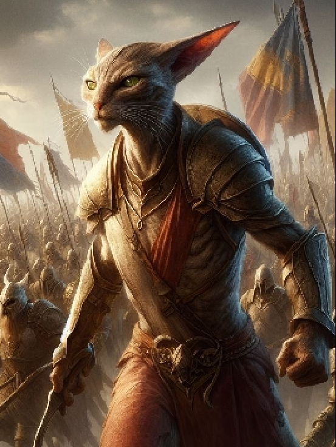

# Lore

## Verts

They are half man and half cat. Agile by nature and sneaky like cats. Strong legs and body give them physical advantage over humans. They are not that smart as humans, but not by much. Moving on two feet, but most traits inherited from cat ancestors.

Humans often enslaved them and use them for cheap labor. They are usually solitary creatures, but inclined more to own kind than to anyone else. Sometimes with strong alpha male making small groups and hunt food together.

