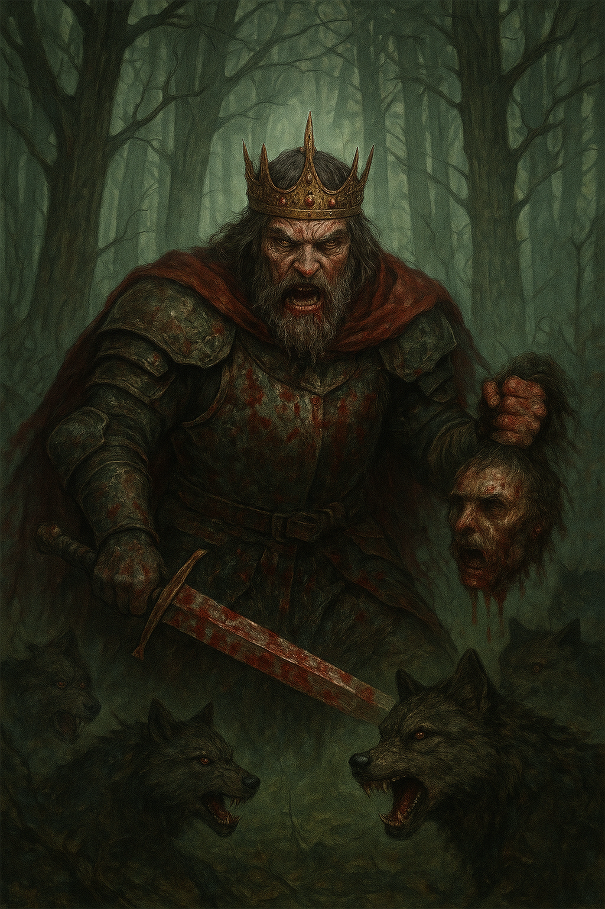

# Lore

## Verts

They are half man and half cat. Agile by nature and sneaky like cats. Strong legs and body give them physical advantage over humans. They are not that smart as humans, but not by much. Moving on two feet, but most traits inherited from cat ancestors.

Humans sometimes enslaved them and use them for cheap labor. They are usually solitary creatures, but inclined more to own kind than to anyone else. Sometimes with strong alpha male making small groups and hunt food together.

## Humans

Kind of rare species, most of them died in wars. Deadly diseases done part in it too.

There is not much from history known. Important figure is their leader king Canan. He is famous for killing every one of his enemy, especialy leaders and royalty everywhere. Burning villages and taking down every one who stand up against him.

He went mad after losing his son. Rumors say wolves killed him and king had few hunts in the woods and wipe almost all of wolf population.

