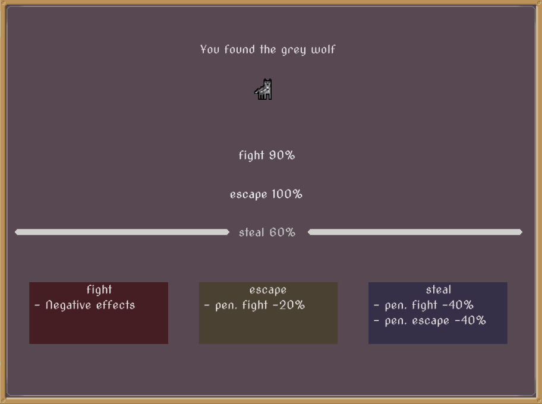

# Skills

There are 4 main player skills, that are shown in character menu.

## Attack

Simple as it sounds. More attack, higher chance to kill an enemy. 
It can be increased by:

* Weapon
* Potion
* Spell

## Pathfindering

How far can player go. It can be increased by boots and with every point you can reach new location.

## Hunt

Hunting increase the change for encaunter rare enemies. Hunters usually wear scarfs.

## Steal

If you dont like killing or like to live like a thief. Steal can result in fight if chance roll against your favor. Than you are penalized for fight and for escape. If you fail to steal and than fail to escape, penalization stacks up.

