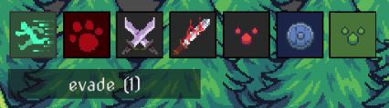

# Special effects

Special effects could be triggered by potion, enemy or quest event. It could be positive or negative. If hoover over by mouse it shows number of turns left for effect to be active.

- *Attack* - +1 to player skill attack
- *Bleeding* - After bleed out, player will die. Neccesary to heal by potion.
- *Evade* - Lower chance to meet enemies on map
- *Hunt* - Higher chance to meet rare enemies
- *Magic attack* - +1 to player skill attack, could be combined with _attack effect_ 
- *Poison* - After ticks out, player will die. Neccesary to cure.
- *Stun* - Lower player chances in fight / steal / escape.